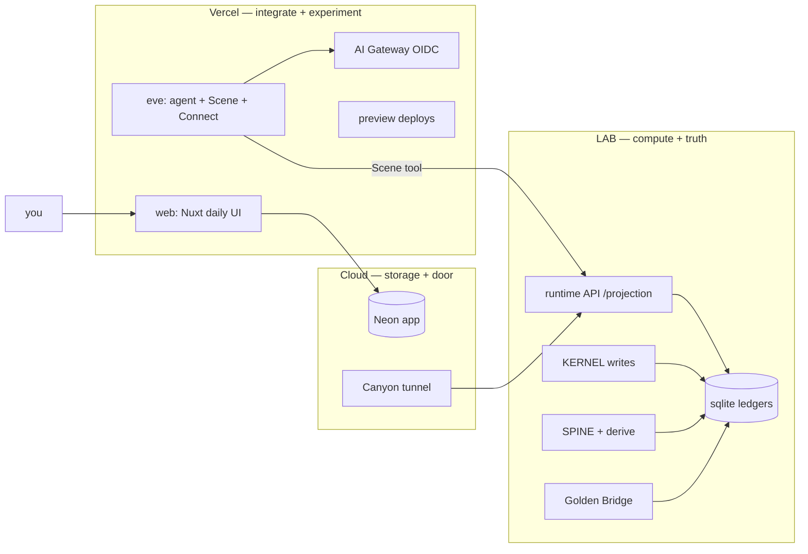

# Dream Machine — Hybrid Deployment (Vercel + Neon + LAB)

> Cleaned and consolidated from the Grok session. Keeps only the hybrid deploy,
> the scripts, and the idea. Drops the build-log, eval debugging, and dead ends.
>
> **Contracts:** [`dream-machine-hybrid-topology.v0.yml`](./dream-machine-hybrid-topology.v0.yml) · [`dream-machine-passport.v0.yml`](./dream-machine-passport.v0.yml)  
> **Operator checklist (verify commands):** [`HYBRID_DEPLOYMENT_TASKLIST.md`](./HYBRID_DEPLOYMENT_TASKLIST.md)

---

## 1. The idea in one screen

**Split authority, not the product.** You keep Vercel integration *and* sovereign
compute by deciding *where consequence is allowed to be registered*.

| Ring | Name | Host | Owns |
|------|------|------|------|
| **3** | Engine room | **LAB 8GB** | KERNEL writes, SPINE derive, sqlite ledgers, `/projection` truth, maintenance |
| **2** | Cockpit | **Vercel Production** | Daily UI, Eve agent, AI Gateway, Connect — wired to real LAB |
| **1** | Experiment lab | **Vercel Preview** | Safe per-branch sandbox: motor, UI, affordances, evals |

Storage and door sit beside the rings:

- **Neon** = the diary (auth, threads, memory — *no compute*).
- **Cloudflare Canyon** = the cable (tunnel `api.lab.minilab.work` → LAB `:3000`).

> **One line:** Vercel is the cockpit, LAB is the engine room, Canyon is the cable
> between them, Neon is the diary. You stop asking Vercel to *be* the ledger.

**Rule:** Vercel never registers consequence. It **reads** LAB through the runtime
seam and **renders** what it gets.

**Identity:** a passport is a **content hash** (`receipt.id == content_hash`,
64-char sha256). `lab:*` strings are display nicknames only and are rejected by
`identity-bridge.ts`. OAuth (`oauth-client.v1`) carries `passport_hash` in AUX.

**"Dynamic" = Eve dynamic, not a separate Vercel product.** Eve checkpoints steps
(Workflow SDK under the hood); `defineDynamic` reshapes the agent per Scene.
Ledger writes never happen on Vercel — proposals cross the airlock back to LAB.



---

## 2. What lives where

| Concern | Host | Why |
|---------|------|-----|
| Daily UI (chat, Scene cards, settings) | Vercel `web` | Where you actually work |
| Eve agent (durable sessions, dynamic tools, HITL) | Vercel `eve` | Half the project, not a sidecar |
| AI Gateway | Vercel | OIDC on linked deploy — **no API key in prod** |
| Vercel Connect (Linear / Slack MCP) | Vercel | Needs Vercel-hosted Eve |
| Preview experiments (T-EVE1, UI, evals) | Vercel Preview | Branch deploys, stub by default |
| LogLine authority (consequence, grants, closure) | LAB | KERNEL |
| Envelope + `derive-from-logline` | LAB | SPINE cognition ledger |
| Ledgers (sqlite) | LAB | Source of truth — **never on Vercel** |
| `POST /projection` | LAB via Canyon | Python bridge → real ProcessViews |
| Fleet + maintenance (`pack:runtime`, backups) | LAB | Golden Bridge |
| Portal DB (auth/threads/memory) | Neon `app` | Shared by prod + previews |

---

## 3. Projects (hybrid)

| Project | Platform | Role |
|---------|----------|------|
| **P1** `dream-machine-portal` | Vercel (`web` + `eve`) | Daily UI + agent + experiments |
| **P2** Neon `app` | Neon | Auth, threads, memory |
| **L1** `dream-machine-lab` | LAB 8GB | KERNEL, SPINE, ledgers, runtime API, Golden Bridge |
| **C1** Canyon `api.lab.minilab.work` | Cloudflare | Tunnel → LAB runtime |
| **P7** CI | GitHub Actions | Deploy Vercel + (optional) SSH seal to LAB |

> Do **not** create separate Vercel projects for KERNEL/SPINE. Those are repos,
> not deploy units. Only P1 goes on Vercel.

**Repos:** FACE deploys from `danvoulez/dream-machine` (fresh). The old
`danvoulez/dream-machine` was renamed `logline-acts-python` — **legacy KERNEL,
stale, keep out of the deploy path until reviewed**. Vercel must deploy `main`.

The whole hybrid is wired by **one env var pair**:

```bash
# Vercel web + eve (production)
DREAM_MACHINE_RUNTIME_URL=https://api.lab.minilab.work
DREAM_MACHINE_RUNTIME_TOKEN=<shared secret with LAB>

# LAB runtime service only — Bearer auth, Vercel is the only allowed caller
DREAM_MACHINE_RUNTIME_TOKEN=<same token>
```

---

## 4. The scripts (this is the operational core)

All `pnpm` scripts live in `Dream-Machine-Processual-UI`. They auto-load the
Projetos root `.env` (gitignored, one level up from FACE).

### Bootstrap (dev machine)

```bash
pnpm bootstrap:hybrid audit            # status table: what's done / missing
pnpm bootstrap:hybrid secrets          # → .env.hybrid.generated (3x openssl rand)
pnpm bootstrap:hybrid integration-neon # vercel integration add neon → env pull
pnpm bootstrap:hybrid migrate          # pnpm db:migrate (use UNPOOLED url)
pnpm bootstrap:hybrid git-remote       # git remote set-url origin <repo>
pnpm bootstrap:hybrid vercel           # project add + link + git connect + env push (web+eve)
pnpm bootstrap:hybrid lab-env          # writes .env.lab.generated for /Lab/env/runtime.env
pnpm bootstrap:hybrid deploy           # pack:runtime + vercel deploy --prod
pnpm bootstrap:hybrid all              # secrets → neon? → migrate? → vercel → lab-env
```

> **Honest note:** `all` does **not** run passport, sync, canyon, or deploy.

| Phase | What it does |
|-------|----------------|
| `audit` | CLI/tools/secrets/contracts/pack status |
| `secrets` | Generate `.env.hybrid.generated` |
| `integration-neon` | `vercel integration add neon` + env pull |
| `neon` | `neonctl` project + DB `app` (alt to integration) |
| `migrate` | `pnpm db:migrate` (unpooled URL) |
| `vercel` | project add, link, git connect, env push |
| `lab-env` | `.env.lab.generated` for LAB |
| `git-remote` | `git remote set-url origin` |
| `deploy` | `pack:runtime` + `vercel deploy --prod` |
| `all` | secrets → neon? → migrate → vercel → lab-env |

### Identity, sync, tunnel, ops

```bash
pnpm bootstrap:passport                # LogLine register → content_hash → .env.hybrid.generated
LAB_HOST=lab-8gb pnpm sync:lab         # rsync Projetos → LAB /Lab/src/
pnpm bootstrap:canyon                  # Cloudflare tunnel + DNS + launchd (run ON LAB)
pnpm ops:status                        # quick health snapshot
```

### LAB (run on the box, after sync)

```bash
cp .env.lab.generated /Lab/env/runtime.env
pnpm setup:lab                         # /Lab layout, ledgers, Golden Bridge, runtime launchd, first deploy
scripts/golden-bridge/install-lab.sh   # launchd plists + cron
scripts/deploy-lab-runtime.sh          # build + run runtime on :3000
```

### Seal + deploy gate

```bash
pnpm contracts:validate    # 17 contracts pass
pnpm pack:runtime          # triple seal (FACE motor + KERNEL oauth seam + SPINE 113 tests)
                           # --skip-spine-test (fast) | --skip-tar (json receipt only)
```

`pack:runtime` is the gate: previews can be wild, but a `main` merge isn't
"deployable" until the seal passes.

---

## 5. Env templates

Three Vercel profiles plus the root `.env`.

```bash
# docs/env/cockpit.env.example  (Vercel Production, web + eve)
DREAM_MACHINE_RUNTIME_URL=https://api.lab.minilab.work
DREAM_MACHINE_RUNTIME_TOKEN=<openssl rand -base64 32>
BETTER_AUTH_URL=https://dream-machine-portal.vercel.app
BETTER_AUTH_SECRET=<openssl rand -base64 32>
INTERNAL_API_SECRET=<openssl rand -base64 32>   # MUST match on web AND eve
DATABASE_URL=<neon app, injected by integration>
DREAM_MACHINE_PASSPORT_MAP={"vercel-user-id":"<64-char content_hash>"}
DREAM_MACHINE_DEFAULT_PASSPORT_HASH=<64-char content_hash>
# AI: no key — Vercel AI Gateway OIDC
```

```bash
# docs/env/experiment.env.example  (Vercel Preview — stub lab default)
DREAM_MACHINE_RUNTIME_SHELL_ONLY=1     # stub: UI/normalizer trials, no LAB
DREAM_MACHINE_ACCEPTANCE=1             # preview-only harness routes
DATABASE_URL=<neon preview branch, auto>
# Promote to live-read only when a PR needs real ledger data:
#   DREAM_MACHINE_RUNTIME_URL=https://api.lab.minilab.work  (read-only token)
```

```bash
# docs/env/lab-runtime.env.example  (LAB engine room only)
DREAM_MACHINE_LOGLINE_DB=/Lab/data/lab.sqlite
DREAM_MACHINE_ENVELOPE_DB=/Lab/data/board.sqlite
DREAM_MACHINE_RUNTIME_TOKEN=<same token as cockpit>
DREAM_MACHINE_RUNTIME_URL=http://127.0.0.1:3000
```

```bash
# Projetos/.env  (root, gitignored, auto-loaded by scripts)
# You fill (D1):
VERCEL_TOKEN=
NEON_API_KEY=
CLOUDFLARE_API_TOKEN=
CLOUDFLARE_ACCOUNT_ID=
DREAM_MACHINE_GIT_REMOTE=https://github.com/danvoulez/dream-machine.git
# Already set:
LAB_HOST=lab-8gb
USE_VERCEL_NEON_INTEGRATION=1
VERCEL_SCOPE=minilab
VERCEL_PROJECT=dream-machine-portal
```

Three preview runtime modes: **Stub** (unset / shell-only — default for most PRs),
**Fixture** (bundled seeded sqlite), **Live-read** (`api.lab` + read-only token).

---

## 6. Minimum Dan (one-time, ~1 hour)

| # | You do | Automatable? |
|---|--------|--------------|
| D1 | Put API tokens in root `.env` (`VERCEL_TOKEN`, `NEON_API_KEY`, `CLOUDFLARE_*`) | manual once |
| D2 | Neon ↔ Vercel: marketplace integration **or** `pnpm bootstrap:hybrid integration-neon` | scripted |
| D3 | AI Gateway OIDC — **automatic** on linked Vercel deploy (no dashboard click) | scripted |
| D4 | Cloudflare tunnel → `pnpm bootstrap:canyon` (fully headless w/ API token) | scripted |
| D5 | `pnpm sync:lab` (SSH key already minted) | scripted |
| D6 | Passport: accept the scripted mint (`pnpm bootstrap:passport`) | scripted |
| D7 | Git remote → fresh `danvoulez/dream-machine`, push `main` | scripted |

One browser login may still be needed once for `cloudflared tunnel login`
*or* `vercel login` *or* first Connect OAuth.

### Bootstrap sequence (cloud first, LAB last)

```bash
cd Dream-Machine-Processual-UI

# --- Step 0: gates (do NOT skip — see §8) ---
pnpm pack:runtime            # must pass

# --- Step 1: core cloud ---
pnpm bootstrap:hybrid secrets
USE_VERCEL_NEON_INTEGRATION=1 pnpm bootstrap:hybrid integration-neon
pnpm bootstrap:hybrid migrate
pnpm bootstrap:hybrid git-remote          # origin → danvoulez/dream-machine
git checkout main && git merge <feature-branch> && git push -u origin main
pnpm bootstrap:hybrid vercel              # creates dream-machine-portal (web+eve)
pnpm bootstrap:passport && pnpm bootstrap:hybrid vercel   # re-push env with passport

# --- Step 2: LAB (Ring 3, for live andamento) ---
LAB_HOST=lab-8gb pnpm sync:lab
ssh lab-8gb 'cd /Lab/src/Dream-Machine-Processual-UI && pnpm setup:lab && pnpm bootstrap:canyon'

# --- Step 3: ship ---
pnpm bootstrap:hybrid deploy
```

Preview can ship in **stub** mode before LAB exists. Production cockpit needs
LAB + Canyon for live Scene/andamento.

---

## 7. Daily + maintenance (runs without you)

**Daily (you):** open the Vercel production URL → chat → andamento. ~2 min.
Experiments: push a branch → Vercel Preview is your lab bench.

**LAB (launchd + cron, automatic):**

| When | Job |
|------|-----|
| Boot | projection runtime (`work.dream-machine.runtime` launchd) |
| Hourly | disk, `/projection` health, cloudflared tunnel |
| Daily | sqlite backup rsync, fleet audit, `pack:runtime` seal, `derive-from-logline` |
| Weekly | `pnpm test:eval` scene-andamento smoke (needs gateway key) |

**Git / CI (GitHub Actions):**

```yaml
# pull_request → experiment lab
- vercel deploy                          # preview
- pnpm test:eval  --base-url $PREVIEW_URL
- playwright test --base-url $PREVIEW_URL

# main → cockpit + seal
- pnpm pack:runtime                      # gate — proves triple-repo
- vercel deploy --prod
- ssh lab restart-runtime                # only if KERNEL/SPINE/data changed
```

---

## 8. Honest status — "says it works" vs "really works"

The transcript's hard-won correction: trust commands, not docs.

**Actually verified:**
- `pnpm contracts:validate` ✓ · `pnpm pack:runtime` ✓ (triple seal)
- Python bridge `rows` mode ✓ (ledgers seeded) · SPINE 113 tests ✓
- `derive-from-logline` idempotent ✓ · passport hash minted ✓

**C0 fixed (2026-06-27 evening):**
- `pnpm test` → **75 pass / 0 skip** (ledger paths via `resolveLoglineDbPath`, not bundled `import.meta.url`)
- `pnpm typecheck` → green
- KERNEL → **273 pass** (`incompleto` close status on `not_dispatched`)

**Still before deploy:**
- FACE feature branch not merged to `main`; GitHub `main` still Vercel template
- Vercel project + Neon integration not created yet

**Code gate (`pack:runtime`) passes on the local triple** — that's the packaged
core the deploy cares about. `logline-acts-python` is irrelevant to this path.

---

## 9. Verify the cable + smoke

```bash
# LAB runtime answers projection (through Canyon, with bearer token)
curl -H "Authorization: Bearer $DREAM_MACHINE_RUNTIME_TOKEN" \
     -H "Content-Type: application/json" \
     -d '{"mode":"rows","scope":{}}' \
     https://api.lab.minilab.work/projection

# Eve health on the deployed portal
curl https://dream-machine-portal.vercel.app/_eve_internal/eve/eve/v1/health
open https://dream-machine-portal.vercel.app/login
```

**Done = Scene card in the Vercel cockpit renders live ProcessViews read from
`api.lab.minilab.work`, with the loss line and legal-move buttons.**

---

## 10. Script sources (in repo)

All scripts referenced above live in `Dream-Machine-Processual-UI/scripts/`:

| Script | `pnpm` / usage |
|--------|----------------|
| `bootstrap-hybrid.mjs` | `bootstrap:hybrid <phase>` |
| `bootstrap-canyon.sh` | `bootstrap:canyon` |
| `bootstrap-passport.mjs` | `bootstrap:passport` |
| `sync-lab.sh` | `sync:lab` |
| `setup-lab.sh` | `setup:lab` |
| `deploy-lab-runtime.sh` | called by `setup:lab` |
| `golden-bridge/*` | hourly/daily/restart via launchd |
| `runtime-projection-local.py` | LAB `/projection` bridge (`rows` mode) |
| `pack-runtime.mjs` | `pack:runtime` |
| `validate-dream-machine-contracts.mjs` | `contracts:validate` |
| `ops-status.sh` | `ops:status` |

---

## 11. Troubleshooting

| Symptom | Fix |
|---------|-----|
| Scene stub | Set `DREAM_MACHINE_RUNTIME_URL` + token; run `pnpm bootstrap:canyon` |
| 401 `/projection` | Token mismatch — re-run `pnpm bootstrap:hybrid secrets` + `lab-env` + sync |
| Passport ignored | Must be 64-char hex — see [`passport-hash.ts`](../agent/lib/passport-hash.ts) |
| Neon preview pollution | `vercel integration add neon` with Preview branching enabled |
| `integration add` fails | Install Neon from dashboard once, paste `DATABASE_URL`, `pnpm bootstrap:hybrid migrate` |
| Canyon headless | `CLOUDFLARE_API_TOKEN` + `CLOUDFLARE_ACCOUNT_ID` on LAB — no `cert.pem` needed |

---

## Related

- [`ENVIRONMENT.md`](./ENVIRONMENT.md)
- [`DREAM_MACHINE_TRIPLE_TASK_LIST.md`](./DREAM_MACHINE_TRIPLE_TASK_LIST.md) — T-HYBRID
- [`docs/env/`](./env/) — cockpit / experiment / lab templates