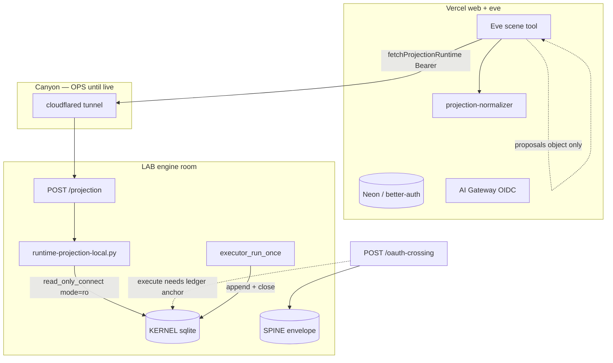

# Dream Machine — Seam Registry (code truth)

> **Version:** `dream-machine-seam-registry.v0` · **Verified:** 2026-06-27  
> **Companion:** [`../HYBRID_DEPLOYMENT.md`](../HYBRID_DEPLOYMENT.md) (deploy) · [`../dream-machine-hybrid-topology.v0.yml`](../dream-machine-hybrid-topology.v0.yml) (rings)

A seam is not a diagram label. A seam is auditable only when it has all five:

```text
contract + enforcement level + code anchor + verify command + known gap
```

Optional sixth field (recommended): **failure mode** — the class of lie the seam exists to prevent.

---

## How to read enforcement levels

| Level | Meaning |
|-------|---------|
| **HARD** | Code rejects the forbidden crossing (throw, exit non-zero, or storage mode blocks write) |
| **PARTIAL** | Enforced on one path; bypass, env gap, or undeployed infra elsewhere |
| **OPS** | Scripted / launchd / tunnel — real when run on LAB, not in app hot path until then |
| **GAP** | Contract or doc exists; no runtime wire yet |

---

## Triple-pack HTTP entrypoints (FACE membrane)

Declared in `plugin/dream-machine-runtime/manifest.json`:

| Route | Seam class | Handler |
|-------|------------|---------|
| `POST /projection` | **runtime** + **projection** (read-only semantic) | `server/routes/projection.post.ts` |
| `POST /oauth-crossing` | **runtime** + **proposal/airlock** (L3 crossing) | `server/routes/oauth-crossing.post.ts` |

Future routes (`POST /proposal`, `POST /effect/intended`) will be **runtime** routes. They must **not** inherit projection’s read-only contract.

---

## Flow (code paths)



---

## Strongest enforced laws today

| Law | Failure mode prevented | Current proof |
|-----|------------------------|---------------|
| Vercel cannot authoritatively write LogLine truth | UI/agent becomes ledger | Scene tool, normalizer `authoritative: false`, `cannot_do`; no `lab/store.append` from FACE |
| `/projection` is read-only at storage | HTTP handler mutates sqlite | Python `read_only_connect()` — sqlite `mode=ro`; no append branch in bridge |
| Deployability is gated | Preview/docs green becomes deploy truth | `pnpm pack:runtime` exits non-zero on any gate failure |
| LAB closure is evidence-bound | “green” without machine evidence | KERNEL `missing_evidence`, `close_evidence_incomplete`, `_validate_close_result` |
| Inline OAuth crossing cannot fake ledger authority | Vercel mints Acts | `/oauth-crossing` execute requires ledger-anchored `content_hash` |

**Bottom line:** read path + seal path + closure path are **real**. Weak seams are **integration** seams (identity map, proposal admission HTTP, live LAB).

---

## Seam registry

Columns: **Failure mode** · **Level** · **Contract** · **Code anchor** · **Verify** · **Gap**

---

### Identity seam

OAuth / external account → passport hash (`receipt.id == content_hash`).

| | |
|--|--|
| **Failure mode** | Display nickname (`lab:dan`, email, Vercel ID) becomes authority |
| **Level** | **PARTIAL** |
| **Contract** | `docs/dream-machine-passport.v0.yml` |
| **Code anchor** | `agent/lib/passport-hash.ts` (HARD hex reject); `scripts/bootstrap-passport.mjs` (mint); `agent/lib/identity-bridge.ts` (`read_only: true`) |
| **Verify** | `pnpm test` (identity-bridge); `pnpm bootstrap:passport` → 64-char `DREAM_MACHINE_DEFAULT_PASSPORT_HASH` |
| **Gap** | `DREAM_MACHINE_PASSPORT_MAP` pushed by bootstrap but **not consumed** in auth/Scene runtime; `identity-bridge` still maps `lab:*` gloss as `lab_id` |

**Carries:** OAuth subject metadata, passport map env, registration hash.  
**Must not carry:** nickname authority, implicit user trust.

---

### Runtime seam

Vercel cockpit / Eve → LAB runtime API (**transport, auth, route class** — not projection semantics).

| | |
|--|--|
| **Failure mode** | Unauthenticated or wrong-class caller reaches LAB commit surface |
| **Level** | **HARD** for production `POST /projection` auth · **PARTIAL** for future non-projection runtime routes |
| **Contract** | `plugin/dream-machine-runtime/manifest.json` · `docs/dream-machine-hybrid-topology.v0.yml` |
| **Code anchor** | **Auth policy (C0.1):** `server/utils/projection-auth.ts` — `isProjectionAuthOpenAllowed`, `verifyProjectionRuntimeAuth` (production + missing token → `503 config_error`), `requireRuntimeTokenForHttp`. **Client:** `agent/lib/projection-bridge.ts` — `postProjectionHttp` calls guard before fetch. **Server:** `server/routes/projection.post.ts`. **Open modes only:** `DREAM_MACHINE_RUNTIME_SHELL_ONLY=1`, `DREAM_MACHINE_RUNTIME_DEV_OPEN=1`, `DREAM_MACHINE_ACCEPTANCE=1` (non-production), `NODE_ENV=test` |
| **Verify** | `pnpm test -- --test-name-pattern 'projection auth'`; production curl without token must get 503 |
| **Gap** | `/oauth-crossing` and future `POST /proposal` routes share token env but are not yet classified per route class (**C0.4**) |

**Owns:** URL, Bearer/Access auth, route class, shell-only mode, server route protection.  
**Does not own:** ProcessView shape, `authoritative: false`, `cannot_do` (projection seam).

---

### Projection seam

LAB ledgers / ProcessViews → Vercel UI (**read-only semantic boundary**).

| | |
|--|--|
| **Failure mode** | Rendered UI state becomes fake ledger truth |
| **Level** | **HARD** |
| **Contract** | `docs/dream-machine-projections.v0.yml` · `docs/dream-machine-actions.v0.yml` |
| **Code anchor** | **Storage:** `scripts/runtime-projection-local.py` — `read_only_connect()`. **Motor:** `agent/lib/scene/scene.ts`, `agent/lib/scene/readers.ts`. **Law:** `agent/lib/projection-normalizer.ts` — always `authoritative: false`, `buildCannotDo()`. **Tool:** `agent/tools/scene.ts` — read-only description + `cannot_do` on every response |
| **Verify** | `pnpm test` (75 pass, 0 skip); `pnpm contracts:validate` |
| **Gap** | None on semantic read path; depends on runtime seam for transport auth in prod |

**Owns:** `mode=ro`, ProcessView shape, `authoritative: false`, `cannot_do`, no append branch.  
**Must not carry:** mutations, inferred truth without source rows.

---

### Proposal seam

Eve / Vercel → LAB admission path (intention ≠ truth).

| | |
|--|--|
| **Failure mode** | Eve request silently becomes committed Act |
| **Level** | **PARTIAL** |
| **Contract** | `docs/envelope-jurisdiction.v0.yml` (`proposal_not_truth`) · `docs/envelope-proposal-to-logline-package.v0.yml` |
| **Code anchor** | `agent/lib/scene/governor.ts` — `proposals()` → `airlock: "human-approval"`; `agent/tools/scene.ts` — effectful intents in `proposals`, not `legal_next_moves`. KERNEL local: `lab/dream.py` — `dream.proposal` receipt |
| **Verify** | `pnpm test` — `proposals surface effectful intents` |
| **Gap** | No production `POST /proposal` or `/admission/intake` on LAB runtime (**C0.4**) |

**Carries:** proposed Act fields, actor context, requested operation.  
**Must not carry:** automatic closure, direct sqlite writes from Vercel.

---

### Airlock seam

Validated proposal → committed consequence (LAB only).

| | |
|--|--|
| **Failure mode** | Irreversible effect without idempotency, evidence, or gate decision |
| **Level** | **HARD** (on LAB) · **PARTIAL** (membrane crossing) |
| **Contract** | `docs/logline-jurisdiction.v0.yml` · `docs/RECEIPT_MOLDS.md` (KERNEL) |
| **Code anchor** | **LogLine:** `lab/store.py` `append()`; `lab/runtime.py` — `executor_run_once`, `close_without_dispatch`, `close_evidence_incomplete`, `_validate_close_result`; `lab/grants.py`. **Membrane:** `agent/lib/oauth-crossing.ts` — execute requires ledger anchor; `envelope-effect-store.ts` |
| **Verify** | `uv run pytest -q` (KERNEL 273 pass); `pnpm test` (oauth-crossing) |
| **Gap** | Full Vercel→LAB proposal admission not wired; oauth crossing is envelope/L3 path, not general airlock |

---

### Diary seam

Vercel app → Neon (portal persistence).

| | |
|--|--|
| **Failure mode** | Neon app state confused with LogLine ledger state |
| **Level** | **PARTIAL** |
| **Contract** | `docs/dream-machine-hybrid-topology.v0.yml` (ring_2 portal DB) |
| **Code anchor** | `server/utils/auth.ts` (better-auth); `server/db/schema/{auth,threads,memory,profile}.ts`; `server/db/migrations/postgresql/` |
| **Verify** | `pnpm bootstrap:hybrid migrate` (after Neon integration); `/login` on deployed portal |
| **Gap** | Neon integration not connected on Vercel yet; local dev may use sqlite |

**Must not carry:** KERNEL truth, ledger closure, process consequence.

---

### Canyon seam

Public internet / Cloudflare → LAB runtime.

| | |
|--|--|
| **Failure mode** | Public internet reaches LAB ports by accident |
| **Level** | **OPS** |
| **Contract** | `docs/dream-machine-hybrid-topology.v0.yml` (C1 Canyon) |
| **Code anchor** | `scripts/bootstrap-canyon.sh`; `scripts/golden-bridge/run-hourly.sh` (tunnel + `/projection` health) |
| **Verify** | `pnpm bootstrap:canyon` on LAB; `pnpm ops:status`; curl `https://api.lab.minilab.work/projection` with Bearer |
| **Gap** | Not proven live from dev machine (**C0.5**) |

---

### Gateway seam

Eve / Vercel → AI Gateway / model providers.

| | |
|--|--|
| **Failure mode** | Model output becomes ledger truth |
| **Level** | **PARTIAL** |
| **Contract** | `docs/dream-machine-core-technologies.v0.yml` (portal_runtime_policy) |
| **Code anchor** | `agent/channels/eve.ts` — `vercelOidc()`; Eve agent loop (cognition jurisdiction) |
| **Verify** | Linked Vercel deploy; prod env has no `AI_GATEWAY_API_KEY` (OIDC) |
| **Gap** | Model outputs not yet pinned to proposal objects everywhere |

---

### Preview seam

Branch deploy → experiment sandbox.

| | |
|--|--|
| **Failure mode** | Branch sandbox mutates production truth |
| **Level** | **PARTIAL** |
| **Contract** | `docs/dream-machine-hybrid-topology.v0.yml` (ring_1 runtime_modes) |
| **Code anchor** | `agent/lib/scene/readers.ts` — `DREAM_MACHINE_RUNTIME_SHELL_ONLY`; `scripts/bootstrap-hybrid.mjs` preview profile; `server/utils/acceptance.ts`; `nuxt.config.ts` gates `/acceptance/*` |
| **Verify** | `DREAM_MACHINE_RUNTIME_SHELL_ONLY=1 DREAM_MACHINE_ACCEPTANCE=1 pnpm dev` → `/acceptance/scene` |
| **Gap** | No automated assert that preview env lacks write/commit tokens (**C0.3**) |

---

### Deploy seal seam

Codebase / branch → production deploy.

| | |
|--|--|
| **Failure mode** | Preview green / docs green becomes deploy truth |
| **Level** | **HARD** |
| **Contract** | `plugin/dream-machine-runtime/manifest.json` · `scripts/validate-dream-machine-contracts.mjs` |
| **Code anchor** | `scripts/pack-runtime.mjs` — contracts → FACE tests → KERNEL oauth pytest → SPINE 113 tests → `.pack/dream-machine.json` |
| **Verify** | `pnpm pack:runtime` |
| **Gap** | Receipt does not yet emit per-seam levels (**C0.6** — planned) |

---

### Sync seam

Dev repo / workbench → LAB source tree.

| | |
|--|--|
| **Failure mode** | Copied source starts running without admission |
| **Level** | **OPS** |
| **Contract** | `docs/HYBRID_DEPLOYMENT.md` § sync |
| **Code anchor** | `scripts/sync-lab.sh`; `scripts/setup-lab.sh` |
| **Verify** | `LAB_HOST=lab-8gb pnpm sync:lab` |
| **Gap** | Copy ≠ activate; requires `setup:lab` + deploy on box |

---

### Maintenance seam

Resident jobs → LAB service authority.

| | |
|--|--|
| **Failure mode** | Ad-hoc daemons, silent autostart, service sprawl |
| **Level** | **OPS** |
| **Contract** | Golden Bridge layout in `scripts/golden-bridge/*` |
| **Code anchor** | `install-lab.sh`, `run-hourly.sh`, `run-daily.sh`; `deploy-lab-runtime.sh` (pack before restart) |
| **Verify** | launchd labels on LAB; logs under `/Lab/logs/` |
| **Gap** | Not running until LAB setup complete |

---

### Connect seam

Slack / Linear / SaaS → Eve / proposal path.

| | |
|--|--|
| **Failure mode** | External platform event becomes Lab truth |
| **Level** | **PARTIAL** |
| **Contract** | `docs/dream-machine-hybrid-topology.v0.yml` (vercel_connect) |
| **Code anchor** | `agent/channels/slack.ts` — `@vercel/connect/eve`; `server/db/schema/slack.ts`; link APIs |
| **Verify** | Connect OAuth once; Slack message wakes Eve session |
| **Gap** | No direct ledger write (good); proposal→airlock loop not closed for Connect events |

---

### Evidence seam

Runtime result / observation → ledger closure.

| | |
|--|--|
| **Failure mode** | Unverifiable success; screenshot as sole proof when machine evidence exists |
| **Level** | **HARD** (KERNEL) |
| **Contract** | `docs/RECEIPT_MOLDS.md` · process `evidence_must_include` |
| **Code anchor** | `lab/runtime.py` — `missing_evidence()`, `close_evidence_incomplete`; tests `test_evidence_incomplete.py` |
| **Verify** | `uv run pytest tests/test_evidence_incomplete.py -q` |
| **Gap** | None on executor path |

---

## Runtime vs projection (do not merge)

| Concern | Runtime seam | Projection seam |
|---------|--------------|-----------------|
| Question answered | *Who may call which route, how?* | *What may this response claim?* |
| Owns | URL, Bearer, route class, shell-only, server auth | `mode=ro`, ProcessView, `authoritative: false`, `cannot_do` |
| Today’s route | `POST /projection` (transport) | same handler (read-only semantics only) |
| Future routes | `POST /proposal`, `POST /effect/intended` | **Do not** inherit projection contract |

---

## Known weak seams (integration, not conceptual)

```text
1. identity.seam     — passport hash minted; map not consumed in runtime auth/Scene
2. proposal.seam     — Scene proposals exist; no LAB HTTP admission queue
3. canyon.seam       — scripts exist; LAB + tunnel not proven live here
```

---

## Hardening order (next work)

| ID | Seam | Task |
|----|------|------|
| **C0.1** | runtime | ~~Require production `/projection` auth unconditionally~~ **done** — `503 config_error` when token unset in production |
| **C0.2** | identity | Consume `DREAM_MACHINE_PASSPORT_MAP` in `identity-bridge` / auth / Scene |
| **C0.3** | preview | Assert preview env cannot contain write/propose/commit tokens |
| **C0.4** | proposal | Add `POST /proposal` or `/admission/intake` — proposal-only, no commit |
| **C0.5** | canyon | Deploy tunnel; prove `api.lab.minilab.work/projection` with Bearer/Access |
| **C0.6** | deploy-seal | `pack:runtime` emits seam receipt with per-seam level |

**Planned pack receipt shape (C0.6):**

```json
{
  "seams": {
    "identity.seam": "PARTIAL",
    "runtime.seam": "HARD:/projection;PARTIAL:other-routes",
    "projection.seam": "HARD",
    "proposal.seam": "PARTIAL",
    "airlock.seam": "HARD",
    "deploy-seal.seam": "HARD"
  }
}
```

---

## Pre-deploy verify (commands)

```bash
cd Dream-Machine-Processual-UI
pnpm contracts:validate && pnpm test && pnpm typecheck && pnpm pack:runtime
cd ../Dream-Machine-LogLine-Acts && uv run pytest -q
```

---

## Closing law

Names are labels. A seam is real only when its forbidden crossing is rejected by code, test, route auth, read-only storage mode, or LAB admission policy.

It does not ask “is the diagram beautiful?” It asks:

```text
what lie does this seam prevent,
where is it rejected,
and what command proves it?
```